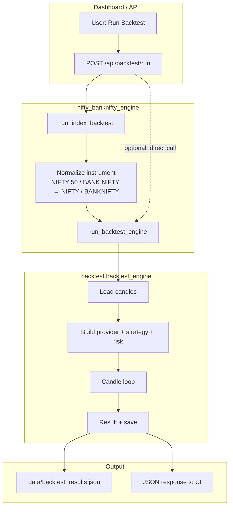

# Backtesting – Block-Level Flow

How backtesting works for NIFTY / BANKNIFTY (and the shared engine). Offline, candle-by-candle replay using the same strategy and risk logic as Paper/Live.

---

## High-level flow



---

## Detailed block flow

```mermaid
flowchart LR
    subgraph INPUT["Inputs"]
        I1[instrument: NIFTY / BANKNIFTY]
        I2[strategy_name]
        I3[from_date, to_date]
        I4[timeframe: 5m / 15m]
        I5[initial_capital, risk%, max_daily_loss%, max_trades]
    end

    subgraph LOAD["1. Load data"]
        L1[nse_symbol(instrument)<br/>constants.nse_symbol]
        L2[engine.data_fetcher<br/>fetch_nse_ohlc]
        L3[Candles: date, O, H, L, C, volume]
        I1 --> L1
        L1 --> L2
        L2 --> L3
    end

    subgraph INIT["2. Initialize"]
        N1[BacktestDataProvider(candles)]
        N2[Strategy = STRATEGY_MAP[strategy_name]]
        N3[RiskConfig + RiskManager]
        N4[session: daily_pnl, virtual_balance, trades_taken_today]
        N5[current_trade = null, trades = []]
        L3 --> N1
        I2 --> N2
        I5 --> N3
        I5 --> N4
    end

    subgraph LOOP["3. Candle loop (for each candle)"]
        P1[provider.set_index(i)]
        P2[In trade?]
        P2 -->|Yes| EX[ strategy.check_exit(current_trade) ]
        EX --> EX2{exit_reason?}
        EX2 -->|Yes| EX3[PnL, append trade, clear current_trade]
        EX2 -->|No| NEXT[next candle]
        P2 -->|No| EN[ strategy.check_entry() ]
        EN --> EN2{can_enter & entry_price?}
        EN2 -->|No| NEXT
        EN2 -->|Yes| EN3[Stop/Target: get_stop_loss_fo_aware / get_target_fo_aware]
        EN3 --> EN4[ risk_mgr.validate_trade(session, entry_price, stop, ...) ]
        EN4 --> EN5{approved & lots > 0?}
        EN5 -->|No| NEXT
        EN5 -->|Yes| EN6[current_trade = entry_price, qty, entry_time, ...]
        EN6 --> NEXT
        EX3 --> NEXT
    end

    INIT --> LOOP

    subgraph RESULT["4. Result"]
        R1[net_pnl, win_rate, max_drawdown]
        R2[equity_curve, trades list]
        R3[save_backtest_result → data/backtest_results.json]
        LOOP --> R1
        LOOP --> R2
        R1 --> R3
        R2 --> R3
    end
```

---

## Component roles

| Block | Location | Role |
|-------|----------|------|
| **run_index_backtest** | `nifty_banknifty_engine/backtest.py` | Normalizes instrument (e.g. NIFTY 50 → NIFTY), calls shared engine. Index-only entry for NIFTY/BANKNIFTY. |
| **nse_symbol** | `nifty_banknifty_engine/constants.py` | Maps NIFTY → "NIFTY 50", BANKNIFTY → "NIFTY BANK" for data fetcher. |
| **run_backtest_engine** | `backtest/backtest_engine.py` | Loads candles, builds provider/strategy/risk, runs candle loop, returns result. |
| **_load_candles** | `backtest/backtest_engine.py` | Uses `engine.data_fetcher.fetch_nse_ohlc(symbol, interval, period)`; filters by from_date / to_date. |
| **BacktestDataProvider** | `backtest/backtest_data_provider.py` | Supplies get_recent_candles, get_ltp, get_vwap, get_rsi from the candle list up to current index. |
| **Strategy** | `strategies/` (STRATEGY_MAP) | `check_entry()` → (can_enter, entry_price); `check_exit(current_trade)` → exit_reason or None. F&O-aware stop/target when present. |
| **RiskManager** | `risk/risk_manager.py` | `validate_trade(session, entry_price, stop, ...)` → (approved, reason, lots). Enforces daily loss and trade limits. |
| **save_backtest_result** | `backtest/backtest_engine.py` | Appends run to `data/backtest_results.json`. |

---

## Candle-loop logic (simplified)

```
for each candle (index i):
  provider.set_index(i)

  if current_trade is not None:
    exit_reason = strategy.check_exit(current_trade)
    if exit_reason:
      exit_price = candle.close
      pnl = (exit_price - entry_price) * qty
      append to trades; update equity; current_trade = None

  else:
    can_enter, entry_price = strategy.check_entry()
    if can_enter and entry_price:
      stop, target = strategy (F&O-aware if available)
      approved, reason, lots = risk_mgr.validate_trade(...)
      if approved and lots > 0:
        current_trade = { entry_price, qty, entry_time, stop, target, strategy_name }

return { trades, net_pnl, win_rate, max_drawdown, equity_curve }
```

---

## Data flow summary

```
UI (Backtest page)
    → POST /api/backtest/run (instrument, strategy, dates, capital, risk params)
    → app calls run_backtest_engine (or run_index_backtest for index path)
        → nse_symbol(instrument) → NSE symbol
        → fetch_nse_ohlc → list of candles
        → BacktestDataProvider(candles) + Strategy + RiskManager
        → for each candle: check_exit or check_entry + validate_trade
        → result dict
    → save_backtest_result(result)
    → JSON response to UI (result with trades, PnL, equity curve)
```

No live/Zerodha calls during the run; all prices come from historical candles.
