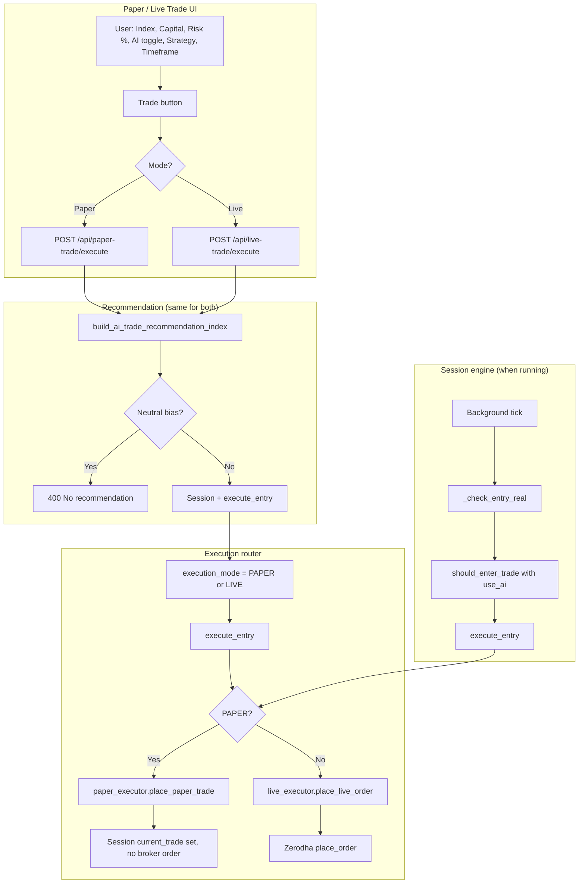
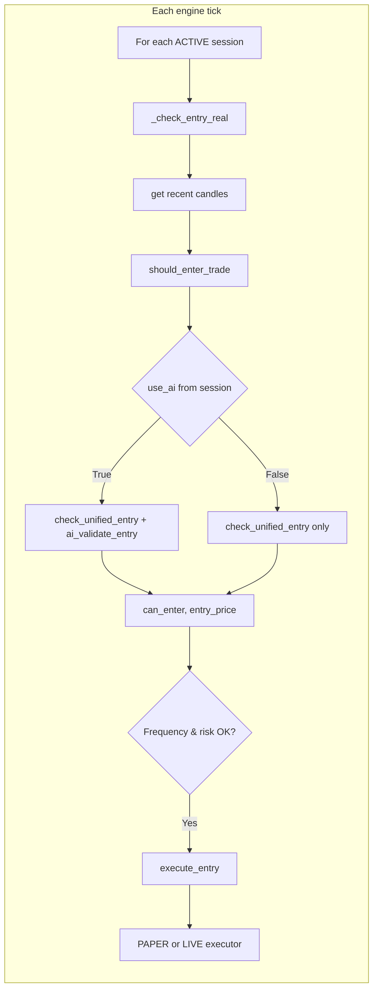

# Live & Paper Trade – Block-Level Flow (Same AI Trading)

How Live and Paper trading work with the same AI and strategy logic. Both use the same entry brain (`should_enter_trade`), risk limits, and execution router; only the execution layer differs (real Zerodha orders vs simulated).

---

## High-level flow



---

## Data flow summary (Live & Paper, same AI)

```
User (Paper or Live page)
  → Inputs: Index (NIFTY/BANKNIFTY), Capital, Risk Per Trade (%), AI Auto-Switching, Strategy, Timeframe
  → Trade click
    → POST /api/paper-trade/execute or /api/live-trade/execute
    → build_ai_trade_recommendation_index(instrument, capital)   [same AI bias & option pick]
    → If neutral → error; else create session (execution_mode = PAPER or LIVE)
    → Get option LTP, compute lots (position sizing + ₹300 cap), stop/target
    → execute_entry(session, ...)  →  paper_executor or live_executor
    → Session current_trade set; Paper = simulated fill, Live = real Zerodha order
  → Executions table: trade-history (mode=PAPER or LIVE) + open sessions
  → Stop button → POST /api/trade-sessions/<id>/kill → execute_exit → same router (paper/live)
```

---

## Shared “brain” (entry logic)

When a **session** is active and the **session engine** runs (background tick):



- **AI Auto-Switching ON** → `use_ai=True` → GPT-based validation can block obviously bad entries.
- **Strategy** (when AI OFF) → fixed strategy name for `check_entry` / exit logic.
- **Timeframe** → used when fetching candles for entry check (e.g. 5m/15m).

---

## Component roles (Live & Paper)

| Block | Location | Role |
|-------|----------|------|
| **build_ai_trade_recommendation_index** | `nifty_banknifty_engine/ai_recommendation.py` | Bias (bias.py), affordable options (options.py); returns strike, CE/PE, tradingsymbol, lots, strategy name. Same for Paper and Live. |
| **execute_entry / execute_exit** | `execution/executor.py` | Routes by `session.execution_mode` to PAPER or LIVE executor. |
| **place_paper_trade** | `execution/paper_executor.py` | Simulated fill (LTP as entry), updates session `current_trade`; no broker call. |
| **place_live_order** | `execution/live_executor.py` | Real Zerodha order; then session `current_trade` set from fill/quote. |
| **_check_entry_real** | `app.py` | Uses `should_enter_trade` (unified_entry) with `use_ai=session.ai_auto_switching_enabled`. |
| **should_enter_trade** | `engine/unified_entry.py` | Same entry logic for Backtest/Paper/Live; optional AI validation. |
| **Risk** | Risk Per Trade (%) editable in UI; API `risk-config?investment_amount=&risk_percent=` returns max_risk_per_trade, daily_loss_limit. |

---

## UI alignment (like Backtest)

Paper and Live pages include the same configuration as in the image and backtest:

1. **Enable AI Auto-Switching** – Toggle ON/OFF (when session engine is used, controls `use_ai`).
2. **Strategy (disabled when AI ON)** – Dropdown: AI Auto-Select, Momentum Breakout, etc. Used when AI is OFF.
3. **Timeframe** – 5 minutes (Recommended), 15 minutes, 1 hour. Used for candle-based entry when applicable.
4. **Risk Per Trade (%)** – Editable input (like backtest); drives Max Risk Per Trade and risk-config API.

Same flow, same AI; only execution mode (PAPER vs LIVE) and real vs simulated orders differ.
