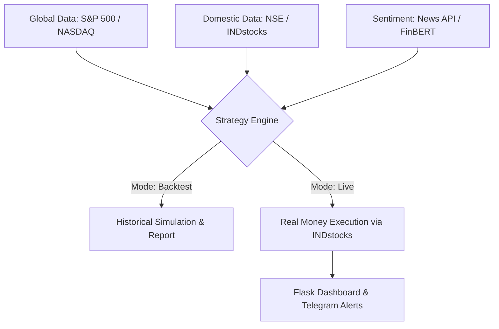

Here is the comprehensive **Project Blueprint and Developer Manifest** formatted as a single `.md` file. You can save this as `README.md` in your project folder or paste it directly into **Cursor’s Composer** to begin the build.

---

# **Project: Kite Quant**

### **High-Conviction Intraday Automation Engine (Zerodha Kite Connect + Python)**

## **1. Project Overview**

This project is a sophisticated algorithmic trading bot designed for the Indian Stock Market (NSE). It focuses on **Multi-Factor Convergence**: only executing trades when Technical Indicators, US Market Sentiment, and Real-time News all align.

### **Core Pillars**

* **Platform:** INDmoney (INDstocks API) for ₹5 low-cost brokerage.
* **Intelligence:** Python-based logic using S&P 500 correlation and NLP sentiment analysis.
* **Safety:** Dual-mode execution (Backtesting vs. Live) with a 3-trade daily "over-trading" limit.
* **Stack:** Python, Flask, INDstocks SDK, FinBERT, yfinance.

---

## **2. System Architecture**



---

## **3. Implementation Roadmap**

### **Phase 1: Environment Setup**

Install the necessary dependencies in your Python environment:

```bash
pip install flask pandas yfinance indstocks-sdk textblob ta-lib python-dotenv

```

### **Phase 2: The Logic (The "High-Conviction" Filter)**

The algorithm will follow a **Strict Consensus Rule**:

1. **Global Bias:** If S&P 500 (US) is down > 0.5%, Block all 'Long' trades for the first hour of NSE.
2. **Sentiment Check:** Scrape Google News for the symbol. If Sentiment < 0.2, skip the trade.
3. **Technical Trigger:** EMA 9/15 Cross + RSI between 40-60 (not overbought).

---

## **4. The "Cursor Master Prompt"**

Copy the block below and paste it into **Cursor (Cmd + I)** to generate the file structure:

```text
Act as a Senior Quant Developer. Build a Flask-based Algorithmic Trading App for the INDmoney (INDstocks) API.

1. DIRECTORY STRUCTURE:
   - /app.py (Flask Server & Routes)
   - /engine/strategy.py (Shared logic for Backtesting and Live)
   - /engine/data_fetcher.py (yfinance for US data, INDstocks for NSE data)
   - /templates/dashboard.html (Web UI with Toggle)
   - /.env (API Keys & Credentials)

2. CORE FEATURES:
   - DUAL MODE: Implement a switch to toggle between 'Backtesting' (using 1-year historical data) and 'Live Trading' (Real Money).
   - US CORRELATION: Fetch ^GSPC (S&P 500) data to set a 'Global Sentiment' bias at 9:15 AM IST.
   - SENTIMENT ANALYSIS: Use TextBlob or VADER to analyze news headlines for the selected stock.
   - TRADING RULES: Limit trades to max 3 per day. Implement a 1:2 Risk-Reward ratio (1.5% Stop Loss / 3% Take Profit).
   - API: Use the INDstocks SDK for order placement and market feed.

3. UI REQUIREMENTS:
   - Create a clean dashboard showing: Current Mode, US Market Status, News Sentiment Score, and a list of Today's Trades (Simulated or Real).

4. SAFETY: Ensure the code includes a 'Panic Kill Switch' button to close all open positions immediately.

```

---

## **5. Configuration (`.env`)**

Create a `.env` file in your root folder to store sensitive data:

```env
IND_API_KEY=your_indmoney_api_key
IND_SECRET=your_indmoney_secret
STATIC_IP=your_whitelisted_ip
NEWS_API_KEY=your_news_api_key
FLASK_ENV=development

```

---

## **6. Backtesting vs. Live Logic**

| Feature | **Backtesting Mode** | **Live Mode** |
| --- | --- | --- |
| **Objective** | Verify Algorithm Performance | Generate Real Profits |
| **Data** | 5-min Historical Candles | Real-time WebSocket Feed |
| **Execution** | Local `results.csv` logging | INDstocks `/place_order` API |
| **Cost** | Free | ₹5 + STT/Charges |

---

## **7. Risk Disclaimer**

* **Slippage:** Historical data does not account for order-book depth.
* **Latency:** Ensure your code is hosted on a VPS (AWS/DigitalOcean) for the fastest execution to minimize delays.
* **Capital:** Never test new algorithms with more than 10% of your total capital.

---

### **Next Steps for You**

1. **Whitelist your IP:** Log into your INDmoney Developer portal and whitelist your Static IP.
2. **Run the Cursor Prompt:** Use the prompt in Section 4 to let Cursor write the initial 5 files.
3. **Test on 1 Stock:** Start by backtesting on a high-liquidity stock like **RELIANCE** or **HDFCBANK**.

**Would you like me to write the specific `strategy.py` file to handle the US Market bias calculation first?**